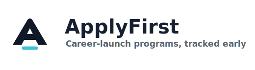
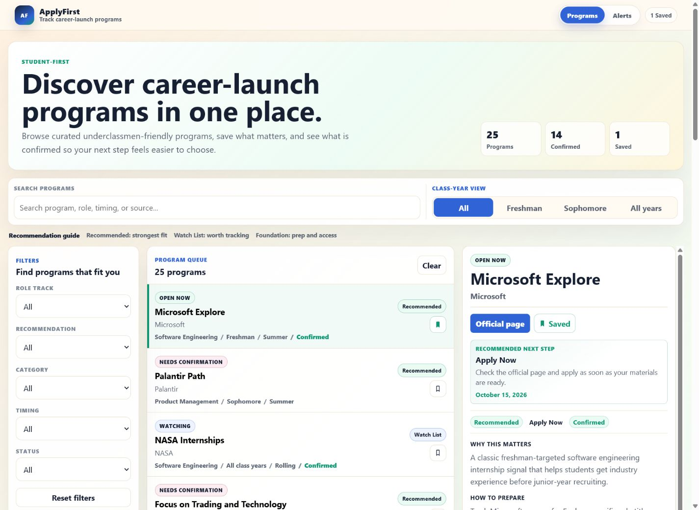
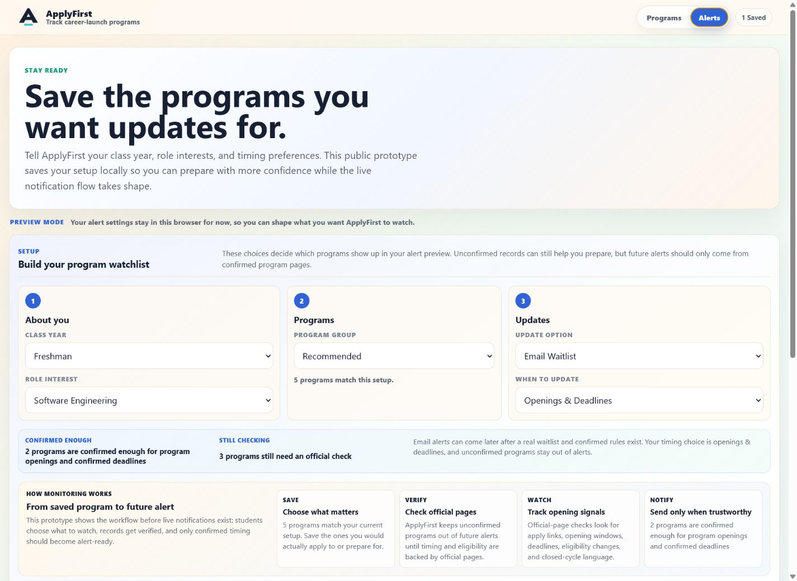
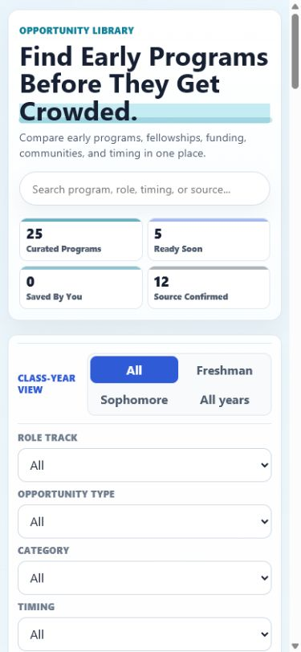

# ApplyFirst

A standalone product MVP for helping underclassmen and emerging technical students discover, track, and prepare for high-signal career-launch programs: underclassmen-friendly internships, fellowships, externships, winternships, scholarships, technical communities, and conference funding paths.

For the reusable product narrative, portfolio angle, scope decisions, and future roadmap, see [PROJECT_BRIEF.md](./PROJECT_BRIEF.md).

## Logo



The mark uses a softened Sharp A with a restrained underline, matching the product tone: mature, career-focused, and early-moving without feeling like a generic job board.

## Screenshots







## Product Direction

ApplyFirst is part of the broader Opportunity Systems product exploration. This app is separate from Kelly's portfolio, so the portfolio can show a case study and screenshots while this app becomes the actual user-facing resource.

ApplyFirst combines two connected layers:

- **Student Opportunity Library**: the public foundation for curated programs, fellowships, scholarships, grants, technical communities, and conference funding paths.
- **Opportunity Signal Tracker**: the product layer for tracking official-page changes, old vs new URLs, application season patterns, sponsor announcements, confidence scores, and human/community verification.

The library is the front door. The tracker is the moat. The current app starts with the library and local monitoring scaffolding, then grows toward trustworthy alerts.

The first version focuses on:

- Class-year fit for freshmen, sophomores, and all class years.
- Role-track fit for software engineering, product management, quant / finance, and Access & Prep programs.
- Special-program categories inspired by underclassmen opportunity lists.
- Recommendation, application status, and confirmation labels.
- Maintainer-only source review and confidence labels.
- Clear notes on why each opportunity matters and how to prepare.
- A future path toward an Opportunity Signal Tracker.

This version is a public prototype with Phase 2 alert preference scaffolding, not a live alerting service yet. The app can show the product direction, curated seed set, local alert preferences, and student-facing confirmation model, while outbound notifications should wait for stronger official-source confirmation.

Recommendation is computed from the Phase 1 rules: underclassmen-fit programs in high-leverage categories become Recommended; relevant programs stay on the Watch List; scholarships, conferences, communities, and resources are treated as Foundation opportunities. Duplicate appearances across older curated lists are useful for verification, but they are not treated as proof that a program is better.

## Source Strategy

Phase 1 treats curated student repos as discovery inputs, not final truth. The app should save users from checking the same programs across multiple lists by normalizing them into one tracker.

- Primary sources: LuisaE/opportunities and zapplyjobs/underclassmen-internships because they focus on underclassmen-friendly programs, exploratory programs, fellowships, scholarships, and prep resources.
- Secondary source: SimplifyJobs/Summer2026-Internships because it is stronger as a live role-posting feed than as a curated early-program list.
- Role-specific sources: PM and quant repos are useful, but they should be filterable tracks instead of the default experience for every user.
- Duplicate signal: if the same program appears across multiple trusted lists, prioritize it for official-source verification and richer tracker notes, not automatic recommendation.

## Local Development

```bash
npm install
npm run dev
```

## Build

```bash
npm run build
```

## Local Monitoring Demo

```bash
npm run monitor:demo
```

This runs the first local monitoring pipeline against seeded official-page samples in `data/monitoring-sources.json`. It compares previous text to current text, classifies the source signal, and prints maintainer review decisions such as Alert Candidate, Deadline Candidate, Prep Watch, Watch Only, or Manual Review.

To rehearse repeated source checks with local snapshot state:

```bash
npm run monitor:persist
```

This writes a gitignored `.applyfirst-monitoring-state.json` file so the next run compares against the last saved normalized text instead of the seed baseline. Persisted reports distinguish new alert candidates from current alert-like signals that have already been seen.

To print only maintainer action items:

```bash
npm run monitor:review
```

This turns changed alert candidates and manual-review checks into a small queue with priority, reason, URL, and next step.

Use `npm run monitor:review:write` to create a gitignored `data/monitoring-review.generated.json` file for local review tooling or a future maintainer console.

To export backend-ready seed data:

```bash
npm run monitor:seed
```

This combines the current curated program records with official source watch rows. Use `npm run monitor:seed:write` to create a gitignored `data/monitoring-seed.generated.json` file for local inspection or future import tooling.

To generate Supabase insert/upsert SQL:

```bash
npm run monitor:seed:sql
```

Use `npm run monitor:seed:sql:write` to create a gitignored `supabase/seed.generated.sql` file.

For the backend/data model plan, see [docs/MONITORING_ARCHITECTURE.md](./docs/MONITORING_ARCHITECTURE.md).

For the draft Supabase schema and future import plan, see [docs/SUPABASE_SETUP.md](./docs/SUPABASE_SETUP.md).

## Phase 2 Start

The first Phase 2 slice adds:

- Local alert preference preview by class year, role track, and recommendation level.
- Confirmation-readiness calculations for records that are safe to alert on later.
- Prioritized source-review queue for records that need official-cycle review before alerts.
- Direct review flow from queue item to full program detail.
- Local verification editor for official URL, previous URL, opening window, deadline, last checked date, confidence, status, and source notes.
- Readiness and queue updates based on those local verification edits.
- Source update plan per record, including watched page, check cadence, next check, alert trigger, and meaningful change signals.
- Local source-check log with checked date, result, and notes.
- Notification strategy preview with local preview, email waitlist, and saved-program reminder modes.
- Alert timing preview for openings, deadlines, and preparation windows.
- Navigation split between the focused Programs view and a separate Alerts setup view.
- Simplified student-facing alert preference section with technical readiness details kept in Maintainer Mode.
- Trust copy that separates records ready to alert from records that still need confirmation.
- Public trust policy for Confirmed, Prep Only, and Needs Confirmation records.
- Local waitlist-intent workflow before accounts, reminders, or real outbound alerts.
- Maintainer Mode toggle for source-review tools, keeping the default view student-facing.
- A clear split between public prototype behavior and future live notifications.
- Student-facing monitoring workflow explanation: save programs, verify official pages, watch opening signals, then notify only when trustworthy.
- Alerts-page saved-program preview showing which bookmarked programs are ready later versus still being checked.

Real email alerts, accounts, and automated page-change monitoring are intentionally still future work.

## Phase 2.5 Source Monitoring Foundation

The first source-monitoring slice keeps the workflow maintainer-controlled instead of sending autonomous alerts.

- Maintainer-only monitoring assistant for pasted official-page text.
- Local classification of page text into application opened, dates updated, eligibility changed, no material change, or needs follow-up.
- Conservative handling for common official-page patterns: interest forms, "not yet open" pages, rolling review language, closed cycles, and future opening windows.
- Maintainer review decision labels for alert candidates, deadline candidates, prep watch, watch-only checks, and manual review.
- Suggested program status and confidence updates before a maintainer confirms them.
- One-click local source-check log entry from the assistant's suggestion.
- One-click local verification update for open window, deadline, last checked date, confidence, status, and source note.
- Human confirmation remains required before any record is treated as alert-ready.

Still future work: backend storage, scheduled crawling, OpenAI-powered interpretation, durable review queues, accounts, and outbound notifications.

## Phase 3 Monitoring Pipeline Foundation

The first Phase 3 slice adds:

- Shared monitoring classifier used by both the UI assistant and local scripts.
- Seeded official-source monitoring examples.
- Local CLI report for changed pages, suggested statuses, confidence, review decisions, new alert candidates, and current alert-like signals.
- Gitignored local snapshot state for repeated monitoring rehearsals.
- Maintainer review queue output for changed alert candidates and manual-review items.
- Generated review queue export for local maintainer tooling.
- Backend seed export for normalized program records and official source watch rows.
- Draft Supabase schema for programs, official sources, snapshots, checks, alert candidates, saved programs, and alert preferences.
- Supabase seed SQL generator for program and official source upserts.
- JSON report output for future automation.
- Monitoring architecture documentation covering backend tables, alert-candidate review, and the human confirmation gate.
